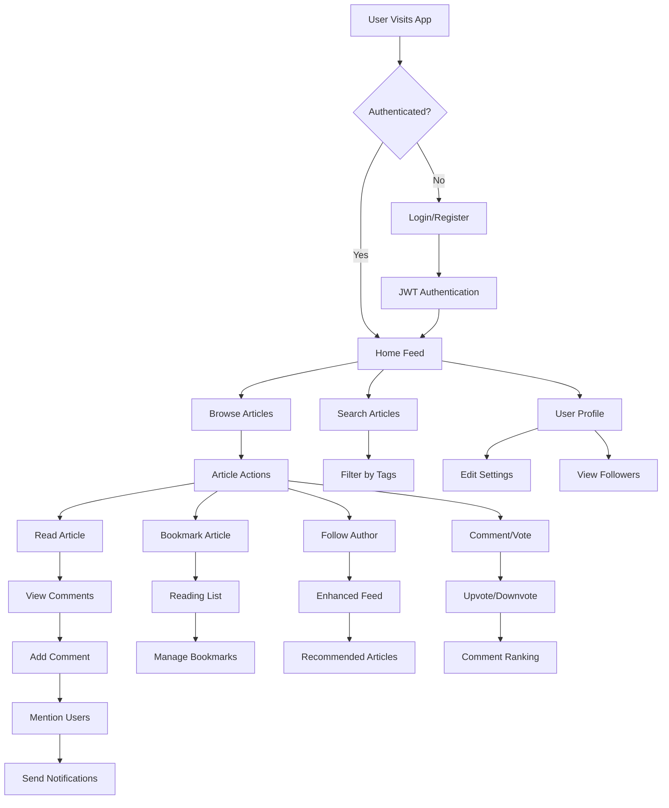

# React + Redux Example App
## RealWorld Frontend

React + Redux codebase containing real world examples (CRUD, auth, advanced patterns, etc) that adheres to the RealWorld spec and API.

[Demo](https://react-redux.realworld.io/) | [RealWorld](https://github.com/gothinkster/realworld)

Originally created for this GH issue. The codebase is now feature complete; please submit bug fixes via pull requests & feedback via issues.

We also have notes in our wiki about how the various patterns used in this codebase and how they work (thanks @thejmazz!)

## 🎯 Successfully Implemented Features

We have successfully implemented all 5 required features plus additional enhancements:

### ✅ Core Required Features
- **Bookmarking System** - Save articles for later reading with dedicated Reading List
- **User Mentions & Notifications** - @username mentions with real-time notification system
- **Recommended Articles** - Smart recommendations based on tags and reading history
- **Comment Upvotes** - Complete voting system for comments with ranking
- **Enhanced Following Feed** - Improved personalized feeds based on user relationships

### 🚀 Bonus Features
- Search functionality across articles
- Offline reading capabilities
- User avatars with fallback initials
- Font size control for accessibility
- Skeleton loading states
- Comment threading system
- Content moderation tools
- Reading history tracking

📋 [View Complete Feature List](./frontend/FEATURES.md)

## 🔄 Application Workflow



## 🏗️ Architecture Overview

```
01_Onera/
├── frontend/          React + Redux application
├── backend/           Node.js + Express + Prisma API
├── demo-video.mp4     Application demonstration video
└── README.md          Setup guide
```

## Getting started

You can view a live demo over at https://react-redux.realworld.io/

### Prerequisites
- Node.js (v14 or higher)
- npm or yarn
- Git

### Complete Local Setup (Frontend + Backend)

#### 1. Clone the repository
```bash
# Clone the main repository containing both frontend and backend
git clone https://github.com/PECATHON/01_Onera.git
cd 01_Onera
```

#### 2. Setup Backend Server
```bash
# Navigate to backend directory (Node.js + Express + Prisma)
cd backend

# Install dependencies
npm install

# Create .env file with required variables
echo "DATABASE_URL=file:./dev.db" > .env
echo "JWT_SECRET=your-secret-key-here" >> .env
echo "NODE_ENV=development" >> .env

# Generate Prisma client
npx prisma generate

# Apply database migrations
npx prisma migrate deploy

# Seed the database (optional)
npx prisma db seed

# Start the backend server (runs on port 3000)
npm start
```

#### 3. Setup Frontend Application
```bash
# Navigate to frontend directory (React + Redux) - in a new terminal
cd frontend

# Install dependencies
npm install

# Update API endpoint to use local backend
# Edit src/agent.js and change API_ROOT to:
# const API_ROOT = 'http://localhost:3000/api';

# Start the frontend server (runs on port 4100)
npm start
```

#### 4. Access the Application
- **Frontend**: http://localhost:4100
- **Backend API**: http://localhost:3000/api

### Quick Start (Frontend Only)
To run just the frontend with the live API:

```bash
# From the main repository root - navigate to frontend
cd frontend
npm install
npm start
```

The frontend will use the live API at https://conduit.productionready.io/api

## Configuration

### Frontend Port Configuration
The frontend runs on port 4100 by default. To change this:

1. Add a `.env` file in the frontend root:
   ```
   PORT=3001
   ```
2. Or modify the package.json scripts section

### Backend API Configuration
To connect the frontend to a different backend:

1. Edit `src/agent.js`
2. Change `API_ROOT` to your backend URL:
   ```javascript
   const API_ROOT = 'http://localhost:3000/api';
   ```

## 📊 Feature Implementation Status

| Feature | Status | Description |
|---------|--------|-------------|
| 🔖 Bookmarking System | ✅ Complete | Save articles, manage reading list |
| 🔔 Mentions & Notifications | ✅ Complete | @username mentions with notifications |
| 📰 Recommended Articles | ✅ Complete | Smart recommendations engine |
| 👍 Comment Upvotes | ✅ Complete | Vote and rank comments |
| 📈 Enhanced Following Feed | ✅ Complete | Personalized content delivery |
| 🔍 Search Functionality | ✅ Bonus | Search articles by content |
| 📱 Offline Reading | ✅ Bonus | Save articles for offline access |
| 👤 User Avatars | ✅ Bonus | Enhanced profile pictures |
| 🎨 Font Size Control | ✅ Bonus | Accessibility improvements |
| 💬 Comment Threading | ✅ Bonus | Nested comment replies |

## Functionality overview

The example application is a social blogging site (i.e. a Medium.com clone) called "Conduit". It uses a custom API for all requests, including authentication. You can view a live demo over at https://redux.productionready.io/

**General functionality:**

- Authenticate users via JWT (login/signup pages + logout button on settings page)
- CRU* users (sign up & settings page - no deleting required)
- CRUD Articles
- CR*D Comments on articles (no updating required)
- GET and display paginated lists of articles
- Favorite articles
- Follow other users

**The general page breakdown looks like this:**

- **Home page** (URL: /#/ )
  - List of tags
  - List of articles pulled from either Feed, Global, or by Tag
  - Pagination for list of articles
- **Sign in/Sign up pages** (URL: /#/login, /#/register )
  - Use JWT (store the token in localStorage)
- **Settings page** (URL: /#/settings )
- **Editor page** to create/edit articles (URL: /#/editor, /#/editor/article-slug-here )
- **Article page** (URL: /#/article/article-slug-here )
  - Delete article button (only shown to article's author)
  - Render markdown from server client side
  - Comments section at bottom of page
  - Delete comment button (only shown to comment's author)
- **Profile page** (URL: /#/@username, /#/@username/favorites )
  - Show basic user info
  - List of articles populated from author's created articles or author's favorited articles

## 🎥 Demo Video

Check out `demo-video.mp4` for a demonstration of the application features.

## 📚 Documentation

- [Frontend README](./frontend/README.md)
- [Backend README](./backend/README.md)

## 🎯 API Endpoints

Base URL: `http://localhost:3000/api`

### Authentication
- `POST /users/login` - Login
- `POST /users` - Register
- `GET /user` - Get current user

### Articles
- `GET /articles` - List articles
- `POST /articles` - Create article
- `GET /articles/:slug` - Get article
- `PUT /articles/:slug` - Update article
- `DELETE /articles/:slug` - Delete article

### Comments
- `GET /articles/:slug/comments` - List comments
- `POST /articles/:slug/comments` - Add comment
- `DELETE /articles/:slug/comments/:id` - Delete comment

### Bookmarks
- `POST /articles/:slug/bookmark` - Bookmark article
- `DELETE /articles/:slug/bookmark` - Remove bookmark
- `GET /bookmarks` - Get bookmarked articles

### Notifications
- `GET /notifications` - Get user notifications
- `PUT /notifications/:id/read` - Mark as read

## 🛠️ Development

### Backend Development
```bash
cd backend
npm run start      # Start server
npm run build      # Build for production
npm test           # Run tests
```

### Frontend Development
```bash
cd frontend
npm start          # Start dev server
npm run build      # Build for production
npm test           # Run tests
```

## 📝 License

MIT

---

Brought to you by [Thinkster](https://thinkster.io)