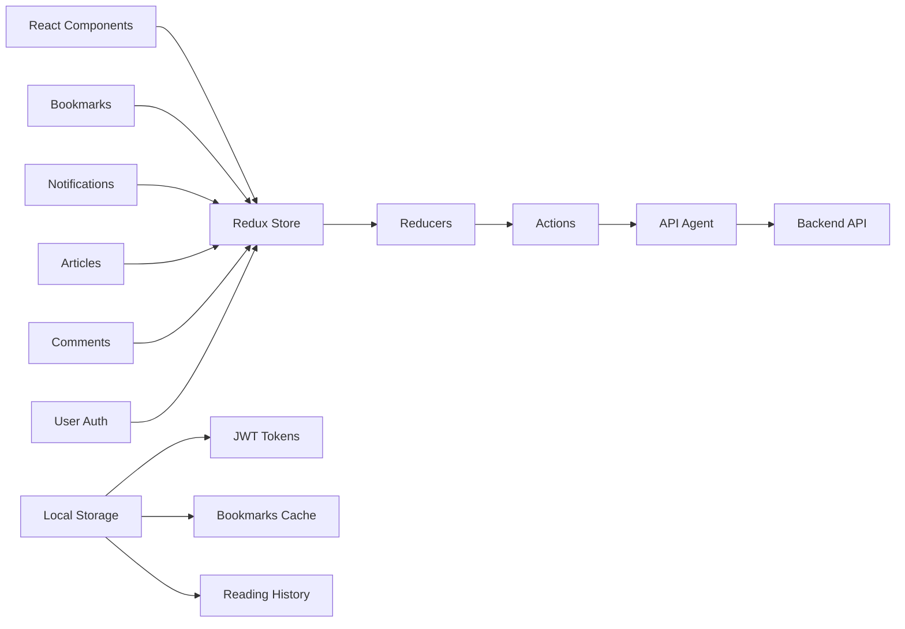

# 

[](http://realworld.io)

> ### React + Redux codebase containing real world examples (CRUD, auth, advanced patterns, etc) that adheres to the [RealWorld](https://github.com/gothinkster/realworld-example-apps) spec and API.

<a href="https://stackblitz.com/edit/react-redux-realworld" target="_blank"></a>&nbsp;&nbsp;<a href="https://thinkster.io/tutorials/build-a-real-world-react-redux-application" target="_blank"></a>

### [Demo](https://react-redux.realworld.io)&nbsp;&nbsp;&nbsp;&nbsp;[RealWorld](https://github.com/gothinkster/realworld)

Originally created for this [GH issue](https://github.com/reactjs/redux/issues/1353). The codebase is now feature complete; please submit bug fixes via pull requests & feedback via issues.

We also have notes in [**our wiki**](https://github.com/gothinkster/react-redux-realworld-example-app/wiki) about how the various patterns used in this codebase and how they work (thanks [@thejmazz](https://github.com/thejmazz)!)

## 🎯 Successfully Implemented Features

We have successfully implemented **all 5 required features** plus additional enhancements:

### ✅ Core Required Features
1. **Bookmarking System** - Save articles for later reading with dedicated Reading List
2. **User Mentions & Notifications** - @username mentions with real-time notification system
3. **Recommended Articles** - Smart recommendations based on tags and reading history
4. **Comment Upvotes** - Complete voting system for comments with ranking
5. **Enhanced Following Feed** - Improved personalized feeds based on user relationships

### 🚀 Bonus Features
- Search functionality across articles
- Offline reading capabilities
- User avatars with fallback initials
- Font size control for accessibility
- Skeleton loading states
- Comment threading system
- Content moderation tools
- Reading history tracking

📋 **[View Complete Feature List](FEATURES.md)**

## 🔄 Application Workflow

```mermaid
flowchart TD
    A[User Visits App] --> B{Authenticated?}
    B -->|No| C[Login/Register]
    B -->|Yes| D[Home Feed]
    
    C --> E[JWT Authentication]
    E --> D
    
    D --> F[Browse Articles]
    F --> G[Article Actions]
    
    G --> H[Read Article]
    G --> I[Bookmark Article]
    G --> J[Follow Author]
    G --> K[Comment/Vote]
    
    H --> L[View Comments]
    L --> M[Add Comment]
    M --> N[@Mention Users]
    N --> O[Send Notifications]
    
    I --> P[Reading List]
    P --> Q[Manage Bookmarks]
    
    J --> R[Enhanced Feed]
    R --> S[Recommended Articles]
    
    K --> T[Upvote/Downvote]
    T --> U[Comment Ranking]
    
    D --> V[Search Articles]
    V --> W[Filter by Tags]
    
    D --> X[User Profile]
    X --> Y[Edit Settings]
    X --> Z[View Followers]
```

## 🏗️ Architecture Overview




## Getting started

You can view a live demo over at https://react-redux.realworld.io/

### Prerequisites

- Node.js (v14 or higher)
- npm or yarn
- Git

### Complete Local Setup (Frontend + Backend)

#### 1. Clone the repository

```bash
# Clone the main repository containing both frontend and backend
git clone https://github.com/PECATHON/01_Onera.git
cd 01_Onera
```

#### 2. Setup Backend Server

```bash
# Navigate to backend directory (Node.js + Express + Prisma)
cd node-express-realworld-example-app

# Install dependencies
npm install

# Create .env file with required variables
echo "DATABASE_URL=file:./dev.db" > .env
echo "JWT_SECRET=your-secret-key-here" >> .env
echo "NODE_ENV=development" >> .env

# Generate Prisma client
npx prisma generate

# Apply database migrations
npx prisma migrate deploy

# Seed the database (optional)
npx prisma db seed

# Start the backend server (runs on port 3000)
npm start
```

#### 3. Setup Frontend Application

```bash
# Navigate to frontend directory (React + Redux) - in a new terminal
cd react-redux-realworld-example-app

# Install dependencies
npm install

# Update API endpoint to use local backend
# Edit src/agent.js and change API_ROOT to:
# const API_ROOT = 'http://localhost:3000/api';

# Start the frontend server (runs on port 4100)
npm start
```

#### 4. Access the Application

- Frontend: http://localhost:4100
- Backend API: http://localhost:3000/api

### Quick Start (Frontend Only)

To run just the frontend with the live API:

```bash
# From the main repository root - navigate to frontend
cd react-redux-realworld-example-app
npm install
npm start
```

The frontend will use the live API at https://conduit.productionready.io/api

### Configuration

#### Frontend Port Configuration

The frontend runs on port 4100 by default. To change this:

- Add a `.env` file in the frontend root:
  ```
  PORT=3001
  ```
- Or modify the `package.json` scripts section

#### Backend API Configuration

To connect the frontend to a different backend:

1. Edit `src/agent.js`
2. Change `API_ROOT` to your backend URL:
   ```javascript
   const API_ROOT = 'http://localhost:3000/api';
   ```

## 📊 Feature Implementation Status

| Feature | Status | Description |
|---------|--------|--------------|
| 🔖 Bookmarking System | ✅ Complete | Save articles, manage reading list |
| 🔔 Mentions & Notifications | ✅ Complete | @username mentions with notifications |
| 📰 Recommended Articles | ✅ Complete | Smart recommendations engine |
| 👍 Comment Upvotes | ✅ Complete | Vote and rank comments |
| 📈 Enhanced Following Feed | ✅ Complete | Personalized content delivery |
| 🔍 Search Functionality | ✅ Bonus | Search articles by content |
| 📱 Offline Reading | ✅ Bonus | Save articles for offline access |
| 👤 User Avatars | ✅ Bonus | Enhanced profile pictures |
| 🎨 Font Size Control | ✅ Bonus | Accessibility improvements |
| 💬 Comment Threading | ✅ Bonus | Nested comment replies |


## Functionality overview

The example application is a social blogging site (i.e. a Medium.com clone) called "Conduit". It uses a custom API for all requests, including authentication. You can view a live demo over at https://redux.productionready.io/

**General functionality:**

- Authenticate users via JWT (login/signup pages + logout button on settings page)
- CRU* users (sign up & settings page - no deleting required)
- CRUD Articles
- CR*D Comments on articles (no updating required)
- GET and display paginated lists of articles
- Favorite articles
- Follow other users

**The general page breakdown looks like this:**

- Home page (URL: /#/ )
    - List of tags
    - List of articles pulled from either Feed, Global, or by Tag
    - Pagination for list of articles
- Sign in/Sign up pages (URL: /#/login, /#/register )
    - Use JWT (store the token in localStorage)
- Settings page (URL: /#/settings )
- Editor page to create/edit articles (URL: /#/editor, /#/editor/article-slug-here )
- Article page (URL: /#/article/article-slug-here )
    - Delete article button (only shown to article's author)
    - Render markdown from server client side
    - Comments section at bottom of page
    - Delete comment button (only shown to comment's author)
- Profile page (URL: /#/@username, /#/@username/favorites )
    - Show basic user info
    - List of articles populated from author's created articles or author's favorited articles

<br />

[](https://thinkster.io)
